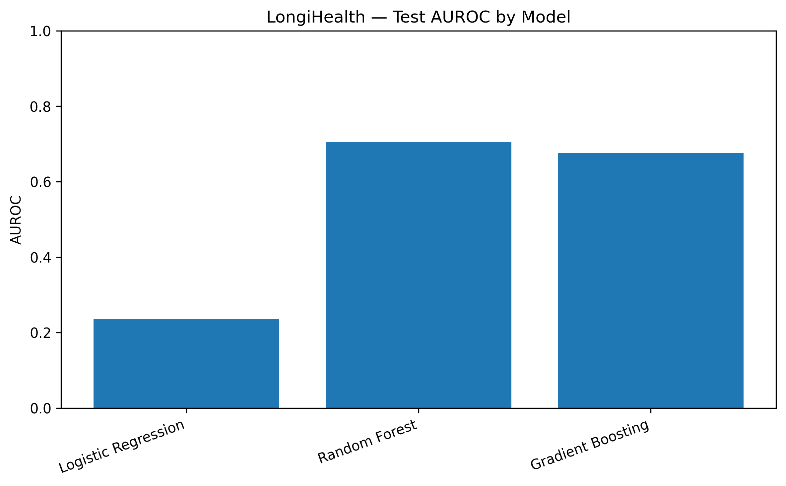
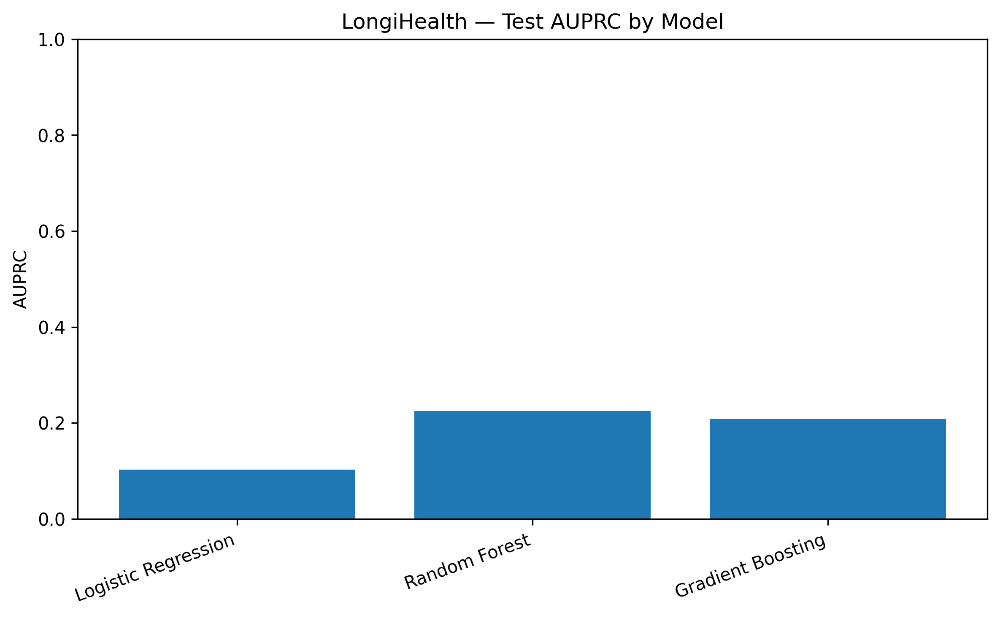
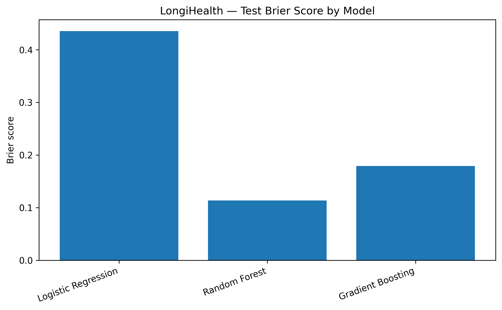
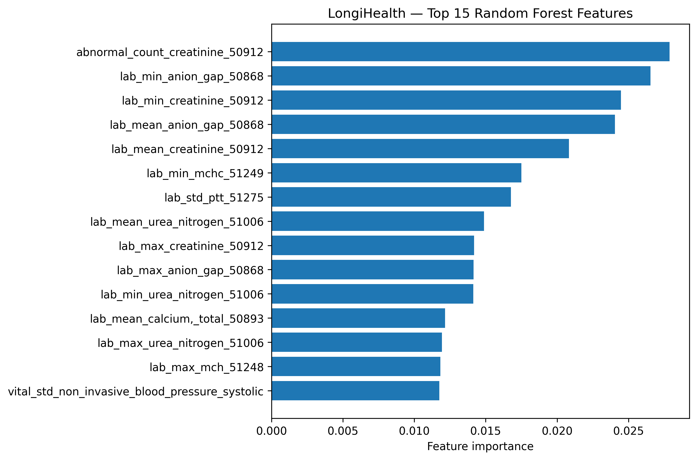

<div align="center">

# 🧬 LongiHealth

### Reproducible Longitudinal EHR Analytics Pipeline

**A Research Software Engineering project for clinical machine learning on MIMIC-IV**

[](https://www.python.org/)
[](https://www.docker.com/)
[](.github/workflows/ci.yml)
[](tests/)
[](LICENSE)
[](https://scikit-learn.org/)

[](https://physionet.org/content/mimic-iv-demo/2.2/)
[](https://doi.org/10.13026/dp1f-ex47)
[](#)
[](#-leakage-prevention)

</div>

---
**Year:** 2026  
**License:** MIT  
**Author:** Sepideh Moafi
---

## 📖 Overview

**LongiHealth** is a reproducible research software pipeline for longitudinal
electronic health record (EHR) analytics and exploratory in-hospital mortality
prediction, built on the **MIMIC-IV Clinical Database Demo v2.2**.

The project is designed as a **Research Software Engineering (RSE)** deliverable,
not as a clinical prediction system. Its central research-software question is:

> *Can a reproducible, leakage-aware clinical data pipeline transform
> heterogeneous early-admission EHR measurements into a structured feature space
> suitable for exploratory outcome modeling?*

LongiHealth emphasizes **data engineering, temporal feature construction,
leakage prevention, reproducibility, automated evaluation, and transparent
interpretation of model limitations** over predictive accuracy.

---

## 🎯 Research Questions

| ID | Question |
|---|---|
| **RQ1** | Can an admission-level ICU cohort be constructed reproducibly from heterogeneous hospital and ICU tables while preserving a well-defined temporal index? |
| **RQ2** | Can laboratory measurements and vital signs observed during the first 24 hours of an ICU stay be transformed into a structured, admission-level feature representation? |
| **RQ3** | Can patient-level splitting and training-only preprocessing prevent information leakage across repeated admissions and between training and evaluation sets? |
| **RQ4** | How do simple baseline machine-learning models compare when predicting in-hospital mortality from the resulting clinical feature representation? |
| **RQ5** | Can the complete analytical workflow be packaged using software-engineering practices such as configuration management, testing, Docker, dependency specification, and continuous integration? |

---

## 🔬 Study Design

```

Hospital admission
│
▼
First ICU stay
│
▼
Index date = ICU admission time
│
├── First 24 hours ──┐
│                    │
│   Laboratory measurements
│   Vital signs
│                    │
└────────────────────┘
│
▼
Clinical feature representation
│
▼
Patient-level train / validation / test split
│
▼
Leakage-safe preprocessing
│
▼
Baseline machine-learning models
│
▼
Automated evaluation + structured reporting

```

The prediction target is **in-hospital mortality**, represented by the
admission-level `hospital_expire_flag`. This outcome and all post-outcome
variables are **excluded from the predictive feature space**.

---

## 📊 Dataset

**Source:** [MIMIC-IV Clinical Database Demo v2.2](https://physionet.org/content/mimic-iv-demo/2.2/)
**DOI:** [10.13026/dp1f-ex47](https://doi.org/10.13026/dp1f-ex47)

| Quantity | Value |
|---|---:|
| Unique patients | **100** |
| Hospital admissions | **128** |
| First ICU stays | **128** |
| Positive mortality outcomes | **15** |
| Mortality rate | **11.72%** |

> ⚠️ Because this is the MIMIC-IV demonstration dataset, the cohort is
> intentionally small and is used for **methodological and software-engineering
> demonstration** rather than clinical validation.

> 🔒 Raw MIMIC-IV data are **not** redistributed with this repository. Users
> must obtain them through PhysioNet and comply with the applicable data-use
> terms.

### Tables used

| Table | Purpose |
|---|---|
| `hosp/admissions.csv.gz` | Admission timing and outcome |
| `hosp/patients.csv.gz` | Demographics |
| `hosp/labevents.csv.gz` | Laboratory measurements |
| `hosp/d_labitems.csv.gz` | Laboratory item dictionary |
| `icu/icustays.csv.gz` | ICU stay timing |
| `icu/chartevents.csv.gz` | Vital-sign measurements |
| `icu/d_items.csv.gz` | ICU item dictionary |

---

## 🧪 Feature Engineering

Clinical information was extracted from two major sources.

### 🔬 Laboratory measurements

Laboratory events were restricted to the first 24 hours after the ICU index
time. For each laboratory item, the pipeline calculated:

- `lab_count` — measurement count
- `lab_mean` — mean value
- `lab_min` — minimum value
- `lab_max` — maximum value
- `lab_std` — standard deviation
- `abnormal_count` — number of values outside the reference range

Extraction result:

| Quantity | Value |
|---|---:|
| Unique laboratory items | **192** |
| Per-item rows | **5,101** |
| Selected laboratory features | **336** |

### 💓 Vital signs

The pipeline extracted clinically relevant ICU measurements using an explicit
whitelist of item IDs:

| Item ID | Concept |
|---|---|
| 220045 | Heart Rate |
| 220050 | Arterial BP systolic |
| 220051 | Arterial BP diastolic |
| 220052 | Arterial BP mean |
| 220179 | Non-invasive BP systolic |
| 220180 | Non-invasive BP diastolic |
| 220181 | Non-invasive BP mean |
| 223762 | Temperature Celsius |
| 226329 | Blood Temperature CCO |
| 228232 | Oxygen saturation |

For each vital-sign item, five statistics were computed:
`count`, `mean`, `min`, `max`, `std`.

| Quantity | Value |
|---|---:|
| Vital-sign concepts | **10** |
| Vital-sign features | **50** |

---

## 📐 Final Clinical Representation

| Feature group | Features |
|---|---:|
| Laboratory measurements | **336** |
| Vital signs | **50** |
| **Total** | **386** |

The final admission-level matrix contained:

```

128 admissions × 386 clinical features

```

with an overall feature missingness of approximately **40.62%** before final
preprocessing.

---

## 🛡️ Leakage Prevention

Leakage prevention was treated as a **central methodological requirement**.

### Patient-level splitting

| Split | Patients | Admissions | Positive outcomes |
|---|---:|---:|---:|
| Train | 70 | 89 | 11 |
| Validation | 15 | 20 | 2 |
| Test | 15 | 19 | 2 |

There is **no patient overlap** between the three partitions.

This is important because individual patients can contribute multiple hospital
admissions. Random admission-level splitting could otherwise allow information
from the same patient to appear in both training and evaluation sets.

### Training-only preprocessing

The following preprocessing operations were fitted **exclusively on training data**:

1. Missingness-based feature filtering (>80% threshold)
2. Constant-feature removal
3. Median imputation
4. Standardization

The resulting transformations were then applied **unchanged** to validation and
test data. This design prevents evaluation data from influencing preprocessing
decisions.

### Forbidden feature columns

The following columns are **never** used as model inputs:

- **Identifiers:** `subject_id`, `hadm_id`, `stay_id`
- **Timestamps:** `index_date`, `intime`, `outtime`, `dischtime`, `deathtime`, `admittime`
- **Administrative:** `admission_type`, `insurance`, `language`, `race`, `marital_status`
- **Demographics (metadata only):** `gender`, `anchor_age`
- **Outcome:** `hospital_expire_flag`, `outcome`
- **Post-outcome:** `los`, `deathtime`, `dischtime`

---

## 🤖 Machine-Learning Baselines

Three baseline classifiers were evaluated.

### 1. Logistic Regression
A linear baseline with `class_weight='balanced'` to establish a simple
reference model.

### 2. Random Forest
A tree-based ensemble (`n_estimators=500`, `max_depth=5`) used to capture
nonlinear relationships and feature interactions.

### 3. Gradient Boosting
A gradient-boosted decision-tree model (`n_estimators=200`,
`learning_rate=0.03`) used as a second nonlinear baseline.

All hyperparameters are defined in `configs/default.yaml` and controlled via
the `random_seed: 42` setting for full reproducibility.

---

## 📈 Evaluation

The pipeline evaluates models using multiple complementary metrics:

- **AUROC** — Area Under the Receiver Operating Characteristic curve
- **AUPRC** — Area Under the Precision-Recall Curve
- **F1 score**
- **Balanced accuracy**
- **Brier score**
- **Confusion matrix**

Because the demonstration cohort contains only **15 positive outcomes**, the
evaluation deliberately avoids treating any single metric as definitive.

---

## 📊 Results

### Model comparison

| Model | Split | AUROC | AUPRC | F1 | Balanced Acc. | Brier |
|---|---|---:|---:|---:|---:|---:|
| Logistic Regression | Validation | 0.5833 | 0.1623 | 0.0000 | 0.4167 | 0.1940 |
| Logistic Regression | Test | 0.2353 | 0.1026 | 0.0000 | 0.2647 | 0.4355 |
| **Random Forest** | **Test** | **0.7059** | **0.2250** | 0.0000 | **0.5000** | **0.1137** |
| Gradient Boosting | Test | 0.6765 | 0.2083 | 0.0000 | 0.3824 | 0.1792 |

The **Random Forest** produced the strongest exploratory test AUROC:

```

AUROC = 0.7059
AUPRC = 0.2250
Brier = 0.1137

```

> ⚠️ These results should **not** be interpreted as evidence of clinical
> predictive performance.

### Figures

| Figure | Description |
|---|---|
|  | Test AUROC by model |
|  | Test AUPRC by model |
|  | Test Brier score by model |
|  | Top 15 Random Forest features |

---

## 🧠 Interpretation

The results demonstrate several methodological observations.

**First**, the nonlinear tree-based models outperformed the linear baseline on
the small demonstration test set. Random Forest achieved the highest
exploratory AUROC, while Gradient Boosting produced a similar but slightly
lower ranking.

**Second**, the classification metrics reveal an important limitation: the
models did not achieve positive-class F1 performance on the reported test
split. This highlights the difficulty of evaluating mortality prediction with
only two positive test cases.

**Third**, the relatively strong AUROC of the Random Forest should therefore be
interpreted cautiously. With only two positive outcomes in the test set, a small
change in prediction ranking can substantially alter the reported metric.

> 🎯 The purpose of this project is consequently **not** to claim a clinically
> useful mortality predictor, but to demonstrate a reproducible analytical
> framework capable of handling longitudinal clinical data while explicitly
> exposing its statistical limitations.

---

## 🔍 Feature Importance

The Random Forest analysis identified several laboratory-derived variables
among the highest-ranked features:

| Rank | Feature |
|---:|---|
| 1 | `abnormal_count_creatinine_50912` |
| 2 | `lab_min_anion_gap_50868` |
| 3 | `lab_min_creatinine_50912` |
| 4 | `lab_mean_anion_gap_50868` |
| 5 | `lab_mean_creatinine_50912` |
| 6 | `lab_min_mchc_51249` |
| 7 | `lab_std_ptt_51275` |
| 8 | `lab_mean_urea_nitrogen_51006` |
| 9 | `lab_max_creatinine_50912` |
| 10 | `lab_max_anion_gap_50868` |

These findings are treated as **model-specific associations** rather than causal
or clinical conclusions. Feature importance does **not** establish that any
individual biomarker causes mortality.

---

## 🏗️ Research Software Engineering

LongiHealth was designed as a **research software project** rather than a
one-off analysis notebook.

### Package structure

```

src/longihealth/
├── init.py           # Package entry point
├── config.py             # YAML configuration loader + validation
├── data.py               # MIMIC-IV ingestion + table loaders
├── cohort.py             # Admission-level ICU cohort construction
├── features_lab.py       # Laboratory feature extraction
├── features_vital.py     # Vital-sign feature extraction
├── features.py           # Final clinical feature matrix + leakage audit
├── split.py              # Patient-level train/val/test splitting
├── preprocess.py         # Leakage-safe preprocessing pipeline
├── models.py             # Baseline classifier builders + training
├── evaluate.py           # Metrics, comparison, structured reporting
└── pipeline.py           # End-to-end orchestration

```

### Software-engineering practices

| Practice | Implementation |
|---|---|
| Modular architecture | 12 isolated modules in `src/longihealth/` |
| Configuration management | `configs/default.yaml` |
| Deterministic execution | `random_seed: 42` |
| Leakage audits | assertions in `features.py` and `split.py` |
| Structured reporting | JSON evaluation report |
| Automated testing | 11 pytest tests in `tests/` |
| Continuous integration | `.github/workflows/ci.yml` |
| Containerization | `Dockerfile` + `.dockerignore` |
| Dependency management | `requirements.txt` |
| License | MIT |
| Citation metadata | `CITATION.cff` |

### Execution

Local:

```bash
PYTHONPATH=src python -m longihealth.pipeline
```

Docker:

```bash
docker build -t longihealth .
docker run --rm longihealth
```

Tests:

```bash
PYTHONPATH=src pytest -q tests
```

---

🔁 Reproducibility

The project separates:

Concern Location
Source code src/longihealth/
Configuration configs/default.yaml
Tests tests/
Reports artifacts/evaluation/*.csv, *.json
Figures artifacts/evaluation/figures/*.png
Notebook notebooks/LongiHealth_Full_Notebook.ipynb
Clinical data excluded from version control

Raw and patient-level derived clinical data are intentionally excluded from
version control via .gitignore and .dockerignore.

---

⚠️ Limitations

Several limitations are fundamental to this study.

Limitation Detail
Small demonstration cohort MIMIC-IV Demo contains only 100 patients
Very small test set Only 19 admissions in the test partition
Very few positive outcomes The test set contains only 2 positive outcomes
Metric instability AUROC, AUPRC, F1 can change substantially with such a small sample
No clinical validation Models are exploratory and not externally validated
No causal interpretation Feature importance represents model behavior only
Demonstration dataset Results cannot be generalized to full MIMIC-IV or real-world deployment

---

🏆 Project Contribution

The main contribution of LongiHealth is not a claim of superior clinical
prediction. Instead, the project demonstrates a complete reproducible workflow:

```
heterogeneous EHR data
        │
        ▼
temporal cohort construction
        │
        ▼
clinical feature engineering
        │
        ▼
leakage-safe preprocessing
        │
        ▼
patient-level evaluation
        │
        ▼
reproducible machine learning
        │
        ▼
automated reporting
```

This makes LongiHealth particularly relevant to:

· 🧪 Research Software Engineering
· 🧬 Biomedical Data Science
· 🩺 Clinical Machine Learning
· 📊 Population-Scale Health-Data Analytics

---

📂 Repository Structure

```
LongiHealth/
├── 📁 src/longihealth/          # Modular pipeline (12 modules)
├── 📁 configs/                  # YAML configuration
├── 📁 tests/                    # pytest test suite
├── 📁 notebooks/                # Full project notebook
├── 📁 artifacts/evaluation/     # Reports + figures
│   ├── model_comparison.csv
│   ├── longihealth_evaluation_report.json
│   └── figures/*.png
├── 📁 .github/workflows/        # CI configuration
├── 📄 README.md
├── 📄 LICENSE
├── 📄 CITATION.cff
├── 📄 Dockerfile
├── 📄 .dockerignore
├── 📄 .gitignore
└── 📄 requirements.txt
```

---

📌 Status

Project status: ✅ Completed exploratory research prototype

The analytical workflow, leakage controls, baseline models, evaluation,
reporting, containerization, and CI configuration have all been developed
and verified.

The project is intended as a research software portfolio project
demonstrating the ability to design reproducible computational workflows for
biomedical and longitudinal health data.

---

📚 Citation

MIMIC-IV

Johnson AEW, Bulgarelli L, Shen L, et al.
MIMIC-IV, a freely accessible electronic health record dataset.
Scientific Data. 2023.
DOI: 10.1038/s41597-022-01899-x

MIMIC-IV Demo

DOI: 10.13026/dp1f-ex47
URL: https://physionet.org/content/mimic-iv-demo/2.2/

LongiHealth

See CITATION.cff in the repository root.

---

<div align="center">

🔬 Built as a reproducible research software artifact

No clinical claims are made or should be inferred.

⬆ Back to top

</div>
```

---

